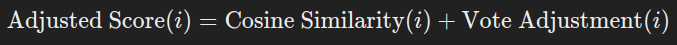
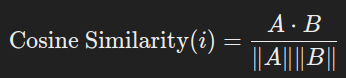
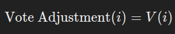
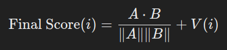

# AniRCM - Anime Recommendation System

AniRCM is an Anime Recommendation System built using Flask (backend) and React (frontend). The system leverages a machine learning model to recommend anime based on user preferences.

## Directory Structure

```bash
├── data/            # Dataset for training the model
├── frontend/        # React frontend app
├── app.py           # Flask app entry point
├── model.ipynb      # Jupyter notebook for model training
├── model.py         # Model loading and recommendation logic
├── Procfile         # For deployment (Heroku)
├── README.md        # Project description
├── requirements.txt # Python dependencies
```

## Features

* Anime Recommendations: Get personalized anime recommendations based on user input.
* Frontend: A React-powered user interface for a seamless experience.
* Backend: Flask serves the recommendations and handles API requests.
* Machine Learning: Utilizes a machine learning model for recommendations.

## Tech Stack

* Frontend: React
* Backend: Flask
* ML Model: Trained using Python and Jupyter notebook (model.ipynb)
* API: Jikan (Unofficial API of MyAnimeList)

## Dataset

[Anime Data from 1970 to 2024]('https://www.kaggle.com/datasets/vaipant/anime-data-from-1970-to-2024')

## Formula for Recommendation

### Adjusted Similarity Score Formula:


Where:

*  Cosine Similarity(i) is the initial similarity score between the item 𝑖 i and the target item, computed using the cosine similarity formula:
   
   
​
*  Vote Adjustment(i) is the adjustment based on the votes from the recommendation dataset, computed as:
   
   

where V(i) is the number of votes for the recommended item 𝑖 i from the dataset.

In essence, the final adjusted score is:



This formula combines the initial cosine similarity score with the votes from the recommendation dataset to prioritize items with higher votes.

## How to Run

### Frontend (React)
1. **Navigate to the frontend Directory:**
   Change to the frontend directory where the React app is located:
   ```bash
   cd frontend
   ```

2. **Install Frontend Dependencies:**
   Install the required JavaScript packages using npm:
   ```bash
   npm install
   ```

3. **Build the React App:**
   Create a production build of the React app:
   ```bash
   npm run build
   ```

**Note:** The React build is integrated into the Flask app, and the static files are served from the build folder.

### Backend (Flask)
1. **Navigate back to the root Directory:**
   Change to the frontend directory where the Flask app is located:
   ```bash
   cd ..
   ```

1. **Install Python and Virtual Environment:**
   Ensure you have Python installed. It’s recommended to use a virtual environment to manage dependencies. If you haven’t already, create and activate a virtual environment:
   ```bash
   python -m venv .venv
   source .venv/bin/activate  # On Windows use `.venv\Scripts\activate`
   ```

1. **Install Dependencies:**
   Install the required Python packages listed in requirements.txt:
   ```bash
   pip install -r requirements.txt
   ```

2. **Run the Flask Server:**
   Start the Flask server:
   ```bash
   python app.py
   ```

3. **Access the website:**
   The server will be running on [http://localhost:5000](http://localhost:5000) by default. You can interact with it through this URL.

## Screenshots

### Home Page


### Result Page


### Top Anime Page
